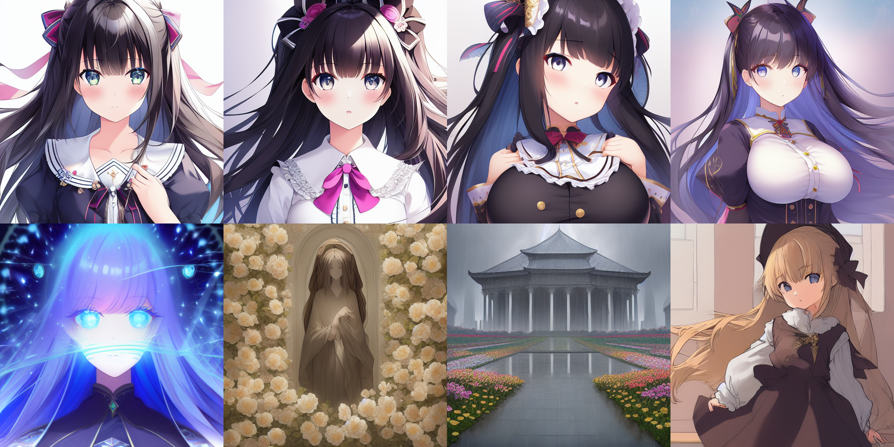
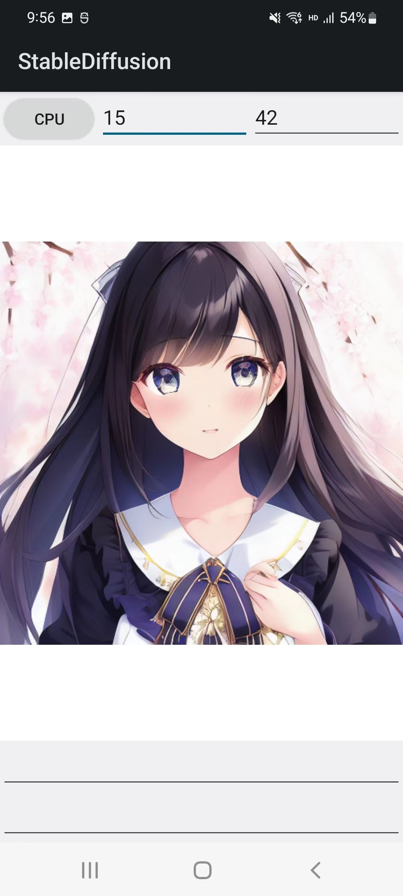

# Stable Diffusion-NCNN

Stable-Diffusion implemented by [ncnn](https://github.com/Tencent/ncnn) framework based on C++ 

Zhihu: https://zhuanlan.zhihu.com/p/582552276

Video: https://www.bilibili.com/video/BV15g411x7Hc

***Performance (time pre-it and ram)***
| per-it | i7-12700 | Snapdragon865 |
| ------ | -------- | ------------- |
| slow   | 5.3s/10G | 20s/7G        |
| fast   | 3.1s/16G |               |

## News
2023-01-04: merge and finish the mha op in x86, enable fast gelu

## Demo



<p align="center">
  
</p>

## Implementation Details

Note: Please comply with the requirements of the SD model and do not use it for illegal purposes

1. Three main steps of Stable-Diffusion：
    1. CLIP: text-embedding
    2. iterative sampling with sampler
    3. decode the sampler results to obtain output images
2. Model details：
    1. Weights：Naifu (u know where to find)
    2. Sampler：Euler ancestral (k-diffusion version)
    3. Resolution：512*512
    4. Denoiser：CFGDenoiser, CompVisDenoiser
    4. Prompt：positive & negative, both supported :)

## Code Details
All models and exe file you can download from [百度网盘](https://pan.baidu.com/s/1Q_p0N3v7Y526Ht3JbxJ1XQ?pwd=6666) or [Google Drive](https://drive.google.com/drive/folders/1myB4uIQ2K5okl51XDbmYhetLF9rUyLZS?usp=sharing)

### Complie for x86
1. download three bin file: ```AutoencoderKL-fp16.bin, FrozenCLIPEmbedder-fp16.bin, UNetModel-MHA-fp16.bin``` and put them to ```assets``` folder
2. open the vs2019 project and compile the release&x64

### Compile for android
1. download three bin file: ```AutoencoderKL-fp16.bin, FrozenCLIPEmbedder-fp16.bin, UNetModel-fp16``` and put them to ```assets``` folder
2. open the vs2019 project and compile the release&x64

### ONNX Model

I've uploaded the three onnx models used by Stable-Diffusion, so that you can do some interesting work.

You can find them from the link above.

#### Statements

1. Please abide by the agreement of the stable diffusion model consciously, and DO NOT use it for illegal purposes!
2. If you use these onnx models to make open source projects, please inform me and I'll follow and look forward for your next great work :)

#### Instructions

1. FrozenCLIPEmbedder

```C++
ncnn (input & output): token, multiplier, cond, conds
onnx (input & output): onnx::Reshape_0, 2271

z = onnx(onnx::Reshape_0=token)
origin_mean = z.mean()
z *= multiplier
new_mean = z.mean()
z *= origin_mean / new_mean
conds = torch.concat([cond,z], dim=-2)
```

2. UNetModel

```C++
ncnn (input & output): in0, in1, in2, c_in, c_out, outout
onnx (input & output): x, t, cc, out

outout = in0 + onnx(x=in0 * c_in, t=in1, cc=in2) * c_out
```

## References

1. [ncnn](https://github.com/Tencent/ncnn)
2. [opencv-mobile](https://github.com/nihui/opencv-mobile)
3. [stable-diffusion](https://github.com/CompVis/stable-diffusion)
4. [k-diffusion](https://github.com/crowsonkb/k-diffusion)
5. [stable-diffusion-webui](https://github.com/AUTOMATIC1111/stable-diffusion-webui)

